# Enterprise AI Transformation (AX) Strategic Roadmap: From Experimental Pilots to Production Value

> **Original Publication Date:** July 29, 2026  
> **Source Column:** [WeSoft Technology Column](https://www.wesoft.co.jp/column/2v_jvun_rtz7/)  
> **Category:** Enterprise AI Strategy / AI Transformation (AX)

---

## 1. Why Enterprise AI Transformation Is Imperative Today

### 1.1 From Research Labs to Everyday Business Operations

Until just a few years ago, "Artificial Intelligence" was widely perceived as a niche capability confined to specialized technical domains and academic research laboratories. Over the past decade, **predictive and analytical AI**—such as Amazon's e-commerce recommendation engines or UPS's delivery route optimization algorithms—delivered measurable business value in narrow, isolated operational functions.

However, the explosive emergence of **Generative AI (Large Language Models, or LLMs)** has expanded AI's reach into every corner of day-to-day enterprise operations.

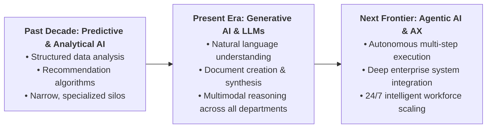

With Generative AI, machine intelligence evolved from a purely statistical analysis tool into a versatile, general-purpose digital assistant capable of following natural language instructions to draft documents, synthesize executive briefings, conduct complex research, extract unstructured data, and generate code.

These shifts are not theoretical hypotheses; they are practical operational realities unfolding across enterprises right now. Forward-looking competitors are already leveraging Generative AI to eliminate operational friction and fundamentally re-engineer business processes. As AI adoption deepens, the divergence in organizational productivity, operational agility, and decision-making velocity between leaders and laggards will widen exponentially.

---

### 1.2 Three Common Executive Misconceptions

In strategic dialogues with corporate boards, C-suite executives, and business unit leaders, three pervasive misconceptions frequently surface:

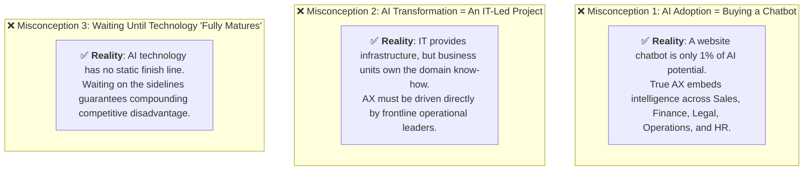

#### ❌ Misconception 1: "AI Adoption Means Buying a Customer Support Chatbot"
Many organizations equate "AI transformation" with deploying an FAQ chatbot on their public website. In reality, customer support bots represent less than 1% of AI's enterprise potential. True AI transformation systematically embeds intelligence into core internal business processes—Sales, Finance & Accounting, Legal & Compliance, Supply Chain, and Manufacturing—empowering every single employee with a high-powered digital copilot.

#### ❌ Misconception 2: "AI Transformation Is Exclusively an IT Department Project"
AI transformation cannot be treated as a traditional software procurement rollout managed solely by IT. Deep, active participation from frontline business units is non-negotiable. It is the business unit leaders who intimately understand where operational bottlenecks reside and which proprietary datasets create real economic value. While IT provides crucial infrastructure, security guardrails, and compliance oversight, AI transformation must be championed and driven by frontline business leaders.

#### ❌ Misconception 3: "We Should Wait Until the Technology Fully Matures"
AI technology has no static "completed" finish line; it is evolving at breakneck speed in continuous rapid cycles. "Waiting for maturity" is a de facto decision to fall behind more agile competitors. Modern frontier foundation models already exhibit advanced natural language reasoning, structured data extraction, and multimodal synthesis capable of delivering immediate, quantifiable ROI today. Early organizational adoption builds institutional muscle memory, creates data flywheels, and establishes a durable competitive moat.

---

### 1.3 The True Essence of AI Transformation (AX)

The core premise of Enterprise AI Transformation is **not** to replace human workers with machines, but to **empower every employee with a tireless, highly capable digital assistant available 24/7/365**.

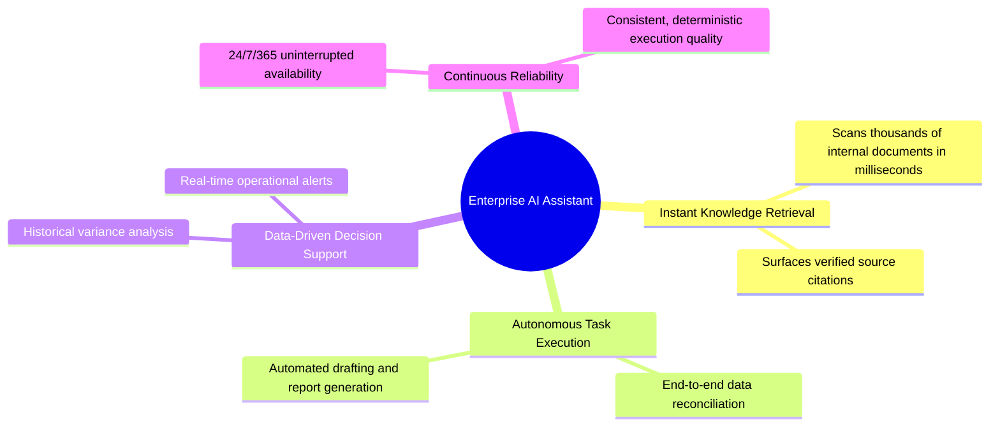

This assistant acts as a force multiplier across four core dimensions:
1. **Instant Knowledge Retrieval**: Ingests and searches thousands of pages of internal SOPs, product blueprints, and historical records in milliseconds.
2. **End-to-End Task Automation**: Handles repetitive data extraction, template population, and routine report generation without manual intervention.
3. **Data-Driven Decision Support**: Cross-references historical performance with real-time operational feeds to deliver synthesized decision-ready briefings.
4. **Continuous, High-Quality Execution**: Operates 24/7/365 with zero fatigue, delivering consistent baseline output quality.

Ultimately, the enterprise business value delivered by AI transformation converges on three strategic pillars: **Cost Reduction**, **Productivity Gains**, and **Accelerated Decision Velocity**.

---

## 2. Department-by-Department Vision: Operations Before vs. After AI

To visualize how AI redefines daily workflows, let's examine practical operational scenarios across six core enterprise functions.

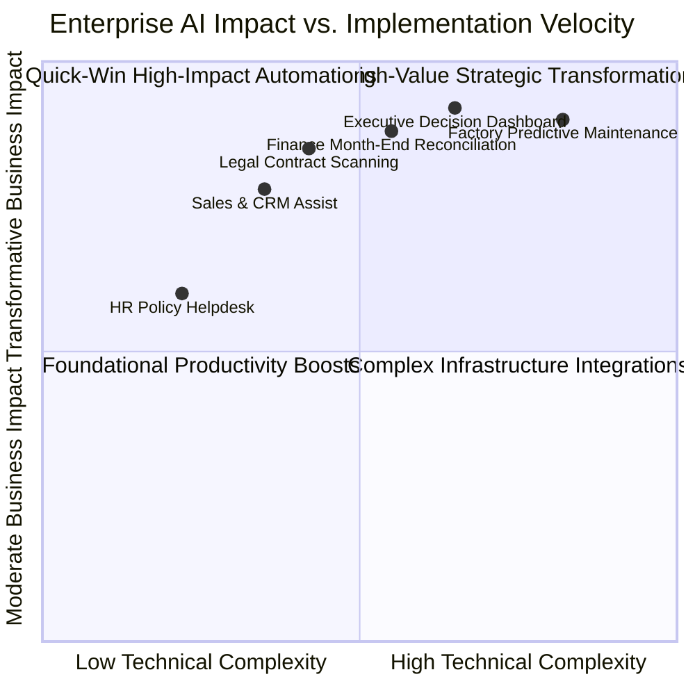

---

### 2.1 Sales & Business Development: From Intuition to AI-Prioritized Pipeline Execution

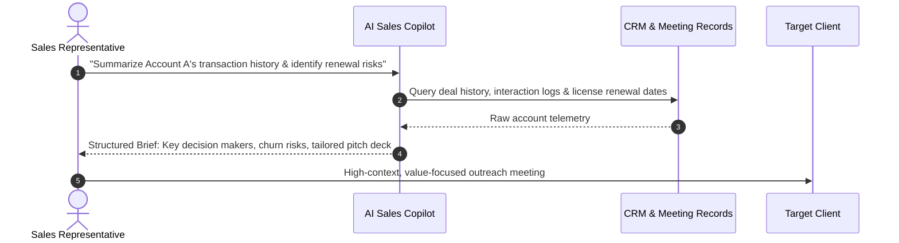

#### 🔴 Before AI Adoption
Sales manager Mr. Sato logged into the CRM every morning, relying on gut instinct and routine habit to determine which accounts his team should follow up on. Junior sales representative Mr. Suzuki struggled to parse fragmented client histories and spent hours chasing low-probability opportunities, resulting in long sales cycles and inconsistent conversion rates.

#### 🟢 After AI Adoption
When Mr. Sato opens his morning dashboard, the AI Sales Copilot automatically evaluates CRM activity feeds, highlighting high-priority accounts showing key conversion or churn signals (such as sudden shifts in product usage or approaching contract expirations). By pairing AI-driven prioritization with his seasoned judgment, Mr. Sato focuses team energy where pipeline velocity is highest.

Furthermore, when Mr. Suzuki prompts the system: *"Summarize Company A's transaction history, past objections, and key stakeholder preferences,"* the AI compiles a comprehensive briefing dossier within seconds. Instead of endlessly digging through historical meeting logs, Mr. Suzuki immediately grasps account dynamics and conducts high-context, confident client calls.

> **💡 Expected Business Impact**: Slashes administrative research time, allowing sales professionals to dedicate maximum hours to client-facing engagement. Significantly shortens junior onboarding time and accelerates on-the-job training (OJT) efficiency.

---

### 2.2 Finance & Accounting: From Month-End Crunch to Real-Time Anomaly Detection

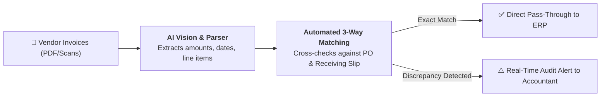

#### 🔴 Before AI Adoption
Accountant Ms. Watanabe faced overwhelming month-end overtime reconciling mountains of vendor invoices, purchase orders, contracts, and delivery receipts. Line-by-line manual verification carried perpetual risks of transposition errors and overlooked anomalies, while expense audits consumed weeks of tedious checking.

#### 🟢 After AI Adoption
The AI Finance Engine automatically ingests invoices in various formats (PDF, scanned images, emails), extracting structured fields (amounts, tax codes, bank details, line items) and cross-referencing them against ERP purchase orders and receiving logs in an automated three-way match. Clean matches flow straight through to payment processing; anomalies instantly trigger exception alerts for human review.

During the monthly financial close, the AI queries transaction databases to generate standard ledger aggregations and preliminary draft commentary. Freed from mechanical data entry, accounting staff devote their expertise to variance analysis, cash flow optimization, and tax compliance.

> **💡 Expected Business Impact**: Eliminates clerical transcription errors, cuts month-end reconciliation labor by over 60%, and elevates accounting teams into strategic financial business partners.

---

### 2.3 Executive Management (CEO & Board): From Lagging Decks to On-Demand Enterprise Visibility

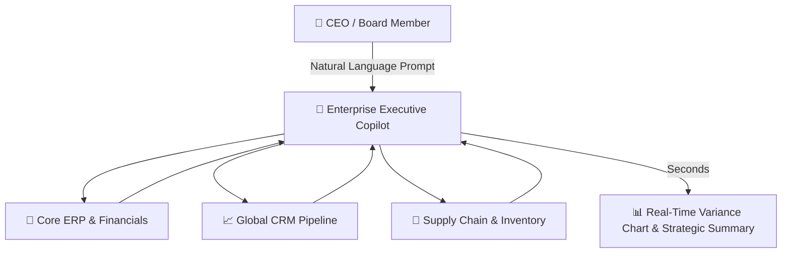

#### 🔴 Before AI Adoption
Whenever President Yamada needed to evaluate enterprise performance, he had to wait weeks for accounting and corporate planning teams to compile monthly board decks. Requesting division-specific breakdowns or drill-downs meant waiting days for analysts to write database queries and reformat spreadsheets.

#### 🟢 After AI Adoption
President Yamada can directly ask his Executive AI Copilot: *"Compare this month's operating profit margins across all regional divisions against last month, and highlight the top three cost drivers."* The AI connects directly to ERP and financial data lakes, delivering real-time interactive charts and analytical summaries in seconds.

Additionally, automated metric sentinels continuously monitor critical KPIs (e.g., Days Sales Outstanding, inventory turnover, regional sales deviations), immediately pushing proactive alerts when key metrics breach predefined thresholds or deviate from plan—allowing executive leadership to address operational challenges before month-end.

> **💡 Expected Business Impact**: Slashes executive time-to-insight from weeks to seconds, fostering an agile, data-driven organizational decision-making cadence.

---

### 2.4 Manufacturing & Plant Operations: From Routine Patrols to Predictive Telemetry Maintenance

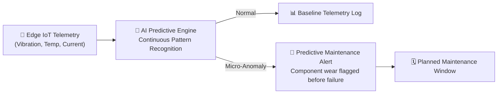

#### 🔴 Before AI Adoption
Plant Manager Mr. Tanaka scheduled daily manual inspection rounds across all equipment lines. Inevitably, sudden mechanical failures still caught teams off-guard, causing unplanned line stoppages, missed delivery deadlines, and expensive emergency repairs. Production scheduling and quality assurance relied almost entirely on the tacit knowledge of veteran mechanics.

#### 🟢 After AI Adoption
AI continuously monitors streaming IoT telemetry from equipment sensors (vibration harmonics, operating temperature, current draw), identifying subtle anomalous patterns days or weeks before a catastrophic mechanical failure occurs. Mr. Tanaka receives predictive maintenance recommendations, allowing his team to replace worn bearings during scheduled downtime.

For production scheduling, AI dynamically balances order priorities, current inventory levels, and machine availability to generate optimized production sequences. When rush orders arrive, AI simulates downstream line impacts in seconds, providing management with clear trade-off scenarios.

> **💡 Expected Business Impact**: Dramatically reduces unplanned factory downtime, shifts maintenance from reactive firefighting to planned preventative maintenance, and optimizes overall equipment effectiveness (OEE).

---

### 2.5 Legal & Compliance: From Exhaustive Manual Reviews to Instant Risk Scanning

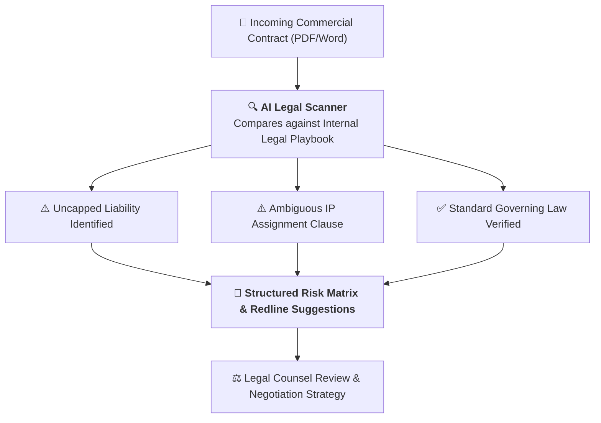

#### 🔴 Before AI Adoption
Legal counsel Mr. Kimura spent days reviewing 50-plus-page commercial contracts, painstakingly reading each clause to ensure alignment with internal governance guidelines and risk tolerances. High contract review volume created severe turnaround bottlenecks for commercial sales teams.

#### 🟢 After AI Adoption
Uploading a contract triggers an instant, comprehensive AI risk scan against the organization's legal playbook. The AI instantly flags potential policy deviations—such as uncapped indemnification clauses, ambiguous intellectual property assignment language, or non-standard governing jurisdictions—providing suggested redline modifications alongside clear rationales. While final sign-off remains with licensed attorneys, the initial screening workload is reduced by up to 80%.

> **💡 Expected Business Impact**: Accelerates contract turnaround cycles, ensures uniform compliance standards across all commercial agreements, and frees legal bandwidth to focus on high-value strategic negotiations.

---

### 2.6 Human Resources & Talent: From Administrative Drudgery to Strategic People Insights

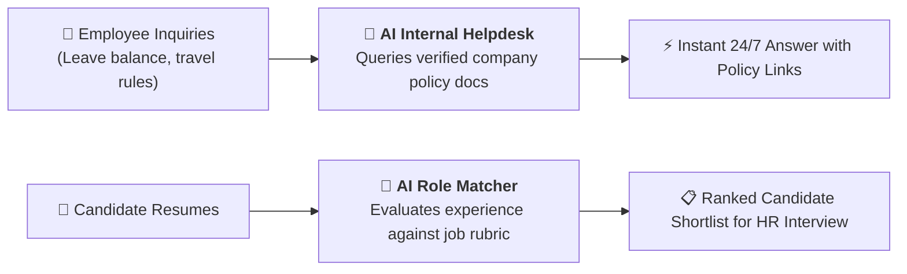

#### 🔴 Before AI Adoption
HR Director Ms. Takahashi was buried under routine administrative burden: manually screening hundreds of candidate resumes, answering repetitive employee questions about leave policies or expense limits, and reconciling attendance records.

#### 🟢 After AI Adoption
An AI Talent Screener analyzes incoming candidate resumes against structured job rubrics, highlighting the most qualified candidates so recruiters can spend more time conducting in-depth culture and competency interviews. Meanwhile, an internal AI Employee Helpdesk resolves 80%+ of routine policy inquiries 24/7 by referencing the latest company handbooks.

Furthermore, AI analyzes aggregated attendance patterns and engagement signals to flag early signs of team burnout or turnover risk, enabling managers to initiate proactive check-ins.

> **💡 Expected Business Impact**: Reduces HR administrative overhead, accelerates candidate screening cycles, and empowers HR leaders to focus on organizational development and talent retention.

---

## 3. Building the Enterprise AI Foundation: Beyond Tool Procurement

Successful AI transformation requires constructing a robust, scalable technical architecture rather than merely accumulating fragmented, siloed SaaS subscriptions.

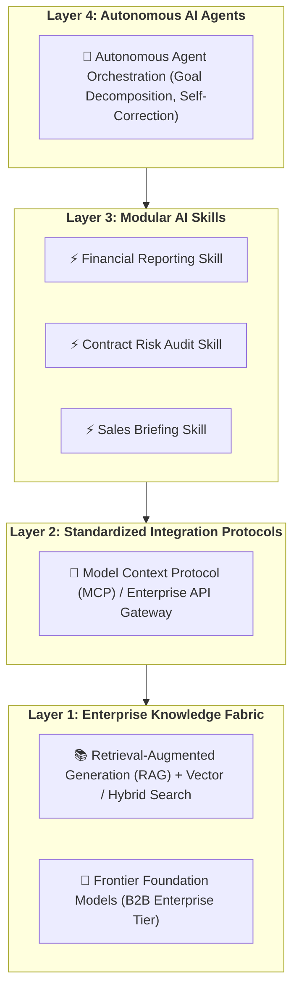

---

### 3.1 Retrieval-Augmented Generation (RAG): Grounding AI in Enterprise Knowledge

Standard foundation models are trained on public internet datasets and have no native awareness of private enterprise assets—such as proprietary product specifications, customized customer terms, or internal operational manuals.

**RAG (Retrieval-Augmented Generation)** bridges this gap. When a user submits a prompt, the system queries secure internal document stores, retrieves the most relevant document passages, and injects them directly into the model's prompt context window.

> 📌 **Clarification on "Understanding"**: In an enterprise context, AI "understanding" does not mean human-like sentience; it refers to the system's ability to accurately reference, synthesize, and reason over internal corporate documentation to produce factual, hallucination-free outputs backed by verifiable source citations.

---

### 3.2 Model Context Protocol (MCP) & Integration Fabric: Unifying Enterprise Systems

Standardized protocols—such as Anthropic's open-standard **Model Context Protocol (MCP)**—provide a uniform specification for connecting AI models to enterprise data sources, internal tools, ERPs, CRMs, and development repositories.

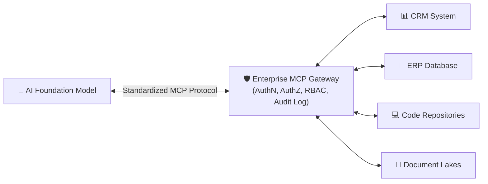

> [!IMPORTANT]
> **Architecture Principle**: Protocol standardization alone does not guarantee security. In practice, enterprise security is enforced by the **governance architecture** wrapped around the protocol: robust authentication (OAuth 2.0 / SAML), fine-grained authorization (RBAC / ABAC), immutable audit logging, and strict data boundary enforcement.

---

### 3.3 Modular AI Skills: Packaging Organizational Know-How

Once RAG and integration layers are established, enterprise operational procedures and SOPs should be codified into reusable, composable **AI Skills**:

| AI Skill | Input Data | Automated Execution Workflow | Final Output |
| :--- | :--- | :--- | :--- |
| **Monthly Revenue Reporting** | CRM & ERP billing data | Data extraction → Financial template aggregation → Executive summary generation | Formatted executive brief with variance tables |
| **Contract Risk Audit** | Executed agreement PDF | Full-text parsing → Risk clause extraction → Corporate playbook comparison → Redline suggestions | Risk score matrix & amendment proposals |
| **Sales Deal Preparation** | Target account name | CRM history query → Meeting notes synthesis → Industry news lookup | Comprehensive 1-page account intelligence dossier |

---

### 3.4 Autonomous AI Agents: Orchestrating Complex Enterprise Workflows

**AI Agents** represent the next frontier of enterprise AI implementation. Unlike rigid traditional RPA (Robotic Process Automation) scripts that fail whenever a field name changes or a button moves, AI Agents possess dynamic reasoning capabilities:

1. **Goal Decomposition**: Break down high-level business objectives into sequential, logical steps.
2. **Context Retrieval**: Leverage RAG to query domain-specific knowledge on demand.
3. **Tool Invocation**: Communicate through standardized integration protocols (MCP) to interact with databases and software APIs.
4. **Adaptive Self-Correction**: Detect errors, retry alternative execution paths, and escalate to human operators when confidence thresholds or guardrails are breached.

---

## 4. Enterprise Security, Governance, and Regulatory Compliance

For enterprise leadership, security and compliance are the essential prerequisites for scaling AI beyond experimental sandboxes into production.

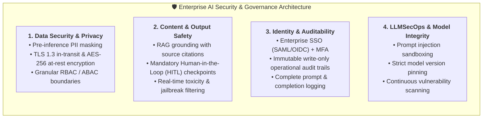

---

### 4.1 Top Three Executive Security Concerns

1. **Data Leakage Risk**: *Will transmitting proprietary customer records or financial data to AI models expose confidential assets to unauthorized third parties?*
2. **Trade Secret & IP Exposure**: *Will employees inadvertently paste proprietary source code, algorithms, or strategic blueprints into AI prompts, leading to unintentional intellectual property exposure?*
3. **Regulatory Non-Compliance**: *Does our enterprise AI deployment comply with evolving regional data privacy laws, intellectual property statutes, and industry regulations?*

---

### 4.2 Commercial B2B Enterprise APIs: Security Guarantees & Enterprise Safeguards

Leading commercial foundation model providers (e.g., Azure OpenAI Service, Google Cloud Vertex AI, AWS Bedrock, OpenAI Enterprise, Anthropic Claude Enterprise) offer enterprise contractual tiers with explicit data privacy commitments:

- **Zero Customer Data Training**: Customer prompts and generated completions are contractually prohibited from being used to train or fine-tune foundation models.
- **Strict Data Retention Controls**: Options for zero data retention (ZDR) or strictly limited 30-day encrypted ephemeral logging solely for abuse monitoring.
- **Enterprise Isolation**: Private VPC endpoints, dedicated customer-managed encryption keys (CMEK), and isolated network perimeters.

> [!WARNING]
> **Enterprise Notice**: Specific data usage terms, retention periods, and residency commitments vary significantly between consumer tiers, standard developer APIs, and dedicated enterprise agreements. Organizations must thoroughly audit Master Services Agreements (MSAs), Data Processing Agreements (DPAs), and data privacy addenda rather than assuming all commercial API tiers offer identical protections.

---

### 4.3 Multilayered Security Safeguards by Domain

| Security Layer | Core Safeguards & Implementations |
| :--- | :--- |
| **Data Security** | Automated pre-inference PII masking/anonymization; TLS 1.3 / HTTPS encryption in transit; AES-256 encryption at rest; fine-grained tenant isolation. |
| **Content Security** | Hallucination mitigation via RAG source grounding; mandatory **Human-in-the-Loop (HITL)** approvals for critical actions; automated content safety filters. |
| **Identity & Access** | Integration with enterprise Identity Providers (IdP) via SAML 2.0 / OIDC; mandatory MFA; granular Role-Based and Attribute-Based Access Control (RBAC/ABAC). |
| **Operations (LLMSecOps)** | Real-time prompt injection detection; system prompt sandboxing; strict model version pinning; immutable audit logging of all agent tool invocations. |

---

### 4.4 Architectural Comparison: Commercial B2B APIs vs. On-Premises Hosting

| Evaluation Dimension | Commercial B2B APIs (e.g., Azure / AWS / Vertex) | On-Premises / Private VPC Hosting |
| :--- | :--- | :--- |
| **Data Protection** | Contractual guarantees (Zero training, custom retention) | Complete physical and air-gapped network isolation |
| **Capital & Operational Cost** | Low CapEx (Pay-as-you-go / consumption-based billing) | High CapEx (Procurement of specialized GPU server clusters) |
| **Operations & Maintenance** | Fully managed by cloud vendor with continuous upgrades | Requires in-house infrastructure & specialized MLOps engineering |
| **Model Reasoning Capability** | Frontier-class models (GPT-4o, Claude 3.5, Gemini 1.5/2.0) | Constrained by local GPU memory and open-weight model size |
| **Time-to-Production** | Days to weeks | Months to quarters |
| **Target Enterprise Profile** | **Overwhelming majority (95%+) of commercial enterprises** | Defense, intelligence agencies, and strictly air-gapped facilities |

---

### 4.5 Global Compliance & Governance Frameworks

Enterprise AI implementations should align with internationally recognized governance standards:

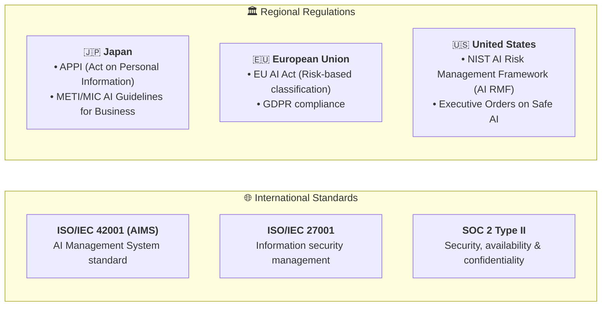

- **ISO/IEC 42001 (AIMS)**: The first international standard for certifying enterprise Artificial Intelligence Management Systems.
- **ISO/IEC 27001 & SOC 2 Type II**: Validate robust foundational information security and operational data safeguards.
- **Regional Regulatory Frameworks**:
  - **Japan**: Act on the Protection of Personal Information (APPI) and the METI/MIC *AI Guidelines for Business* (AI事業者ガイドライン).
  - **European Union**: The EU AI Act (enforcing risk-tiered regulatory classifications) and strict GDPR compliance.
  - **United States**: NIST AI Risk Management Framework (NIST AI RMF 1.0) and federal AI safety mandates.

---

### 4.6 Strategic Conclusion: Governance Is an Accelerator, Not a Brake

A common organizational misconception is that security, compliance, and governance exist solely to halt innovation.

In reality, **enterprise AI governance is not an emergency handbrake—it is a high-performance braking system designed to give leadership the confidence to step on the gas pedal.**

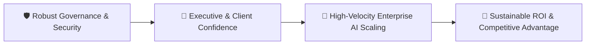

By establishing robust enterprise contracts, clear governance operating models, and defense-in-depth technical safeguards, organizations can effectively mitigate operational risks while fully unleashing the transformational business power of Artificial Intelligence.

---

## 5. Strategic Roadmap: Phased Implementation Timeline

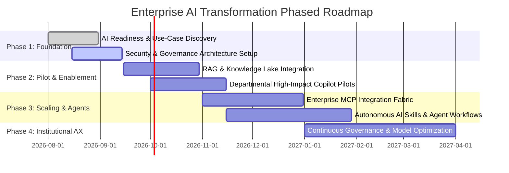

1. **Phase 1: Foundation & Governance (Month 1–2)**: Audit data assets, establish enterprise B2B API contracts, configure SSO/RBAC, and institute AI usage guidelines.
2. **Phase 2: Knowledge Grounding & Quick-Win Pilots (Month 2–4)**: Deploy RAG-powered internal search across high-friction departments (Sales Copilot, HR Helpdesk, Legal Scanner).
3. **Phase 3: Deep System Integration & AI Skills (Month 4–7)**: Implement MCP gateways to connect ERP/CRM data lakes, modularizing recurring business processes into composable AI Skills.
4. **Phase 4: Agentic Autonomy & Enterprise Scale (Month 7+)**: Deploy autonomous multi-step AI agents with human-in-the-loop validation, scaling AI transformation across the entire corporate fabric.
