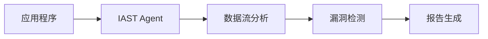

# IAST - 交互式应用安全测试

## 什么是IAST?

IAST (Interactive Application Security Testing) 是一种在应用运行时检测安全漏洞的技术。

## 核心特点

- **实时检测** - 在应用运行时发现漏洞
- **低误报率** - 结合动态和静态分析
- **精确定位** - 提供详细的漏洞路径

## 主要工具

1. **Contrast Security**
2. **Checkmarx IAST**
3. **Seeker**

## 工作原理

## 应用场景

- CI/CD集成
- 开发阶段测试
- 生产环境监控

---

[← 返回Web安全](./) | [← 返回首页](/)
